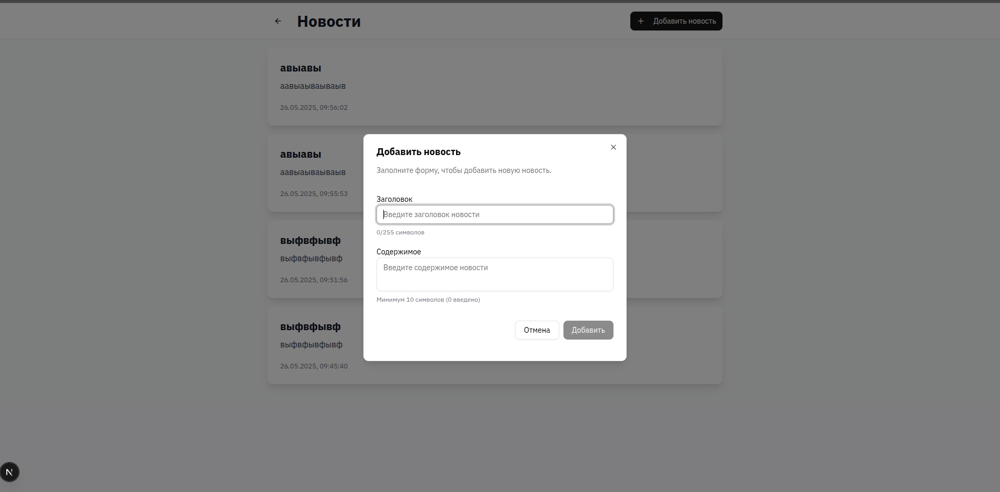
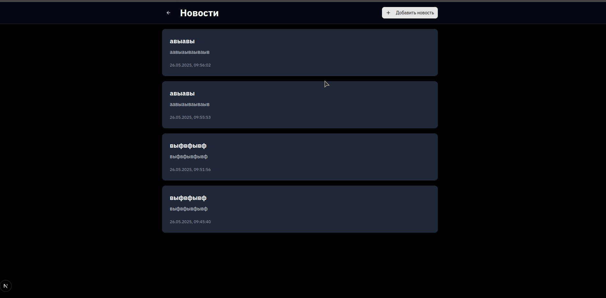
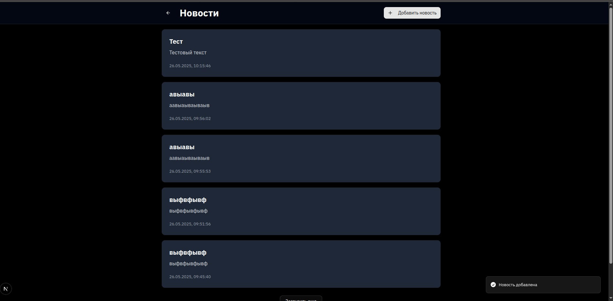

# Задание: Реализуйте кеширование списка новостей через Redis с механизмом сброса при добавлении новой записи.
# 📰 Laravel News API

API-проект на Laravel для управления новостями с поддержкой кэширования через Redis и хранением сессий в базе данных.

## 🚀 Возможности

- 📄 CRUD-операции для новостей
- ⚡ Кэширование списка новостей на Redis (1 час)
- 🔄 Автоматический сброс кэша при добавлении новой новости
- 🧠 Валидация данных на стороне сервера
- 🐘 Использование MySQL в качестве основной базы данных
- 🔐 Сессии хранятся в базе данных
- 📦 Гибкая настройка окружения через `.env`

---

## 📸 Скриншоты интерфейса

### 🔹 Список новостей


### 🔹 Создание новости


### 🔹 Уведомление об успешном создании


---

## 📂 Структура API

### `GET /api/news`

Получить список новостей (с пагинацией).

**Параметры (опционально):**

- `page` — номер страницы (по умолчанию 1)
- `per_page` — количество новостей на страницу (по умолчанию 10)

### `POST /api/news`

Создать новую новость.

**Пример тела запроса:**

```json
{
  "title": "Новая новость",
  "content": "Подробности новой новости здесь..."
}
````

Отлично! Ниже полная инструкция по установке и запуску **всего проекта**, включая **Next.js frontend**, **Laravel backend**, **XAMPP** и **Redis Cloud**. Она подойдёт для новичков и среднеопытных разработчиков.

---

# 📰 Fullstack News Project — Установка и запуск

## 📦 Состав проекта

| Компонент   | Назначение                           |
| ----------- | ------------------------------------ |
| Laravel     | Backend REST API (на PHP)            |
| Next.js     | Frontend SPA (на React + TypeScript) |
| XAMPP       | Локальный сервер MySQL + Apache      |
| Redis Cloud | Внешнее кэш-хранилище                |

---

## 🔧 Часть 1: Установка XAMPP

1. **Скачай XAMPP**:
   [https://www.apachefriends.org/index.html](https://www.apachefriends.org/index.html)

2. **Установи XAMPP** и открой **XAMPP Control Panel**

3. **Запусти сервисы**:

   * Apache ✅
   * MySQL ✅

4. Проверь доступность:

   * Перейди в браузере по адресу → [http://localhost/phpmyadmin](http://localhost/phpmyadmin)

---

## 📂 Часть 2: Установка Laravel Backend

### ✅ Шаг 1. Клонирование проекта

```bash
cd /путь_к_htdocs  # Например, cd C:\xampp\htdocs
git clone https://github.com/your-username/news-backend.git
cd news-backend
```

### ✅ Шаг 2. Установка зависимостей

```bash
composer install
```

### ✅ Шаг 3. Настройка переменных окружения

```bash
cp .env.example .env
php artisan key:generate
```

Открой `.env` и укажи настройки базы данных:

```dotenv
DB_CONNECTION=mysql
DB_HOST=127.0.0.1
DB_PORT=3306
DB_DATABASE=news
DB_USERNAME=root
DB_PASSWORD=  # если пустой пароль
```

Укажи параметры Redis Cloud:

```dotenv
CACHE_DRIVER=redis

REDIS_HOST=redis-xxxx.c000.us-east-1-1.ec2.cloud.redislabs.com
REDIS_PORT=12345
REDIS_USERNAME=default
REDIS_PASSWORD=yourpassword
REDIS_DB=0
REDIS_CACHE_DB=1
```

> 🔐 Используй [Redis Cloud](https://redis.com/try-free/) и скопируй адрес и порт из вашей панели.

### ✅ Шаг 4. Создание базы данных

* Зайди в `http://localhost/phpmyadmin`
* Создай БД с именем `news`

### ✅ Шаг 5. Применение миграций

```bash
php artisan migrate
```

### ✅ Шаг 6. Запуск сервера

```bash
php artisan serve
```

Теперь Laravel работает по адресу: [http://localhost:8000](http://localhost:8000)

---

## 🌐 Часть 3: Установка Next.js Frontend

### ✅ Шаг 1. Клонируй и установи

```bash
cd ..
git clone https://github.com/your-username/news-frontend.git
cd news-frontend
npm install
```

### ✅ Шаг 2. Создай файл `.env.local`

```env
NEXT_PUBLIC_API_URL=http://localhost:8000/api
```

> Укажи адрес, где работает Laravel backend

### ✅ Шаг 3. Запусти фронтенд

```bash
npm run dev
```

Next.js будет доступен по адресу: [http://localhost:3000](http://localhost:3000)

---

## 📤 Проверка работы

1. Перейди на [http://localhost:3000](http://localhost:3000)
2. Добавь новость через форму
3. Новость должна отобразиться (используется кэш Redis)

---

## 🔁 Кэш Redis Cloud

Laravel использует Redis Cloud для хранения кэша списка новостей.
Это нужно для повышения производительности при большом трафике.

* Ключи кэша сбрасываются автоматически при добавлении новостей
* Redis используется через Laravel `Cache::remember()` и `Cache::getRedis()->keys(...)`

---

## 💡 Полезные команды Laravel

```bash
php artisan migrate:fresh       # Очистка и повторная миграция
php artisan config:clear        # Очистка кэша конфигурации
php artisan cache:clear         # Очистка кэша приложения
php artisan route:list          # Список доступных маршрутов
```

---

## ❓ Частые ошибки

| Ошибка                                  | Решение                                              |
| --------------------------------------- | ---------------------------------------------------- |
| `SQLSTATE[42S01]: Table already exists` | Таблица уже есть — удали или сбрось миграции         |
| `Call to undefined method getRedis()`   | Убедись, что `CACHE_DRIVER=redis` и Redis доступен   |
| `Class Redis not found`                 | Установи расширение Redis в PHP или используй predis |

---

## 🏁 Готово!

Теперь у тебя локально работает:

* ✅ Laravel API с кэшем
* ✅ Next.js фронтенд
* ✅ MySQL база через XAMPP
* ✅ Redis Cloud


## 🤝 Авторы

* Roman — разработка и архитектура API

---

## 📄 Лицензия

Этот проект распространяется под лицензией MIT.

